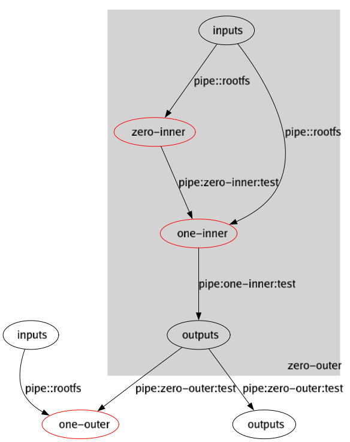

CLI Examples
============

This document contains examples of using the `warpforge` CLI to do a variety of operations.

---

These fixtures are executed by tests in the `cmd/warpforge` package.

These fixtures are executable by parsing them using
the [testmark](https://github.com/warpfork/go-testmark) format.
Some of the code blocks below are config files and content,
and each scenario also has one code block which is a script,
which is exactly what you would execute in a normal shell.

---

FUTURE: this might be a little more readable (and less redundant on fixtures)
if reorganized to show topic areas like "here's the things you can do on modules", etc.

---

## Recursively Run Modules

Using `./...` will traverse recursively from `.` and execute all `module.json` files found.

[testmark]:# (runall/sequence)
```
warpforge run ./...
```

This works even if there are no modules found; the output will simply be empty:

[testmark]:# (runall/output)
```
```


## Check Input Files are Valid

This usage will infer the file's type based on its name, then check it for validity.
Multiple files can be provided, and unrecognized filenames will be ignored.

[testmark]:# (check/sequence)
```
warpforge check *
```

If everything passes, the output is silent, as good unix-style tools should be:

[testmark]:# (check/output)
```
```

(TODO: this probably needs a verbose flag, too, so we can more easily see that it's actually doing work!)

## Check a Formula is Valid

Specific formats can also be checked explicitly, using `check` commands specific to that subsystem:

[testmark]:# (checkformula/sequence)
```
warpforge --json --verbose formula check formula.json
```

We'll run this in a filesystem that contains a `formula.json`:

[testmark]:# (checkformula/fs/formula.json)
```
{
    "formula": {
        "inputs": {
            "/": "ware:tar:7P8nq1YY361BSEvgsSU3gu4ot1U5ieiFey2XyvMoTM7Mhwg3mo8aV2KyGwwrKRLtxS"
        },
        "action": {
            "exec": {
                "command": [
                    "/bin/sh",
                    "-c",
                    "echo hello from warpforge!"
                ]
            }
        },
        "outputs": {}
    },
    "context": {
		"warehouses": {
			"tar:7P8nq1YY361BSEvgsSU3gu4ot1U5ieiFey2XyvMoTM7Mhwg3mo8aV2KyGwwrKRLtxS": "https://dl-cdn.alpinelinux.org/alpine/v3.14/releases/x86_64/alpine-minirootfs-3.14.2-x86_64.tar.gz"
		}
    }
}
```

Together with the verbosity and output formatting flags used above, this will also emit the checked document again:

[testmark]:# (checkformula/output)
```
{
	"formula": {
		"inputs": {
			"/": "ware:tar:7P8nq1YY361BSEvgsSU3gu4ot1U5ieiFey2XyvMoTM7Mhwg3mo8aV2KyGwwrKRLtxS"
		},
		"action": {
			"exec": {
				"command": [
					"/bin/sh",
					"-c",
					"echo hello from warpforge!"
				]
			}
		},
		"outputs": {}
	},
	"context": {
		"warehouses": {
			"tar:7P8nq1YY361BSEvgsSU3gu4ot1U5ieiFey2XyvMoTM7Mhwg3mo8aV2KyGwwrKRLtxS": "https://dl-cdn.alpinelinux.org/alpine/v3.14/releases/x86_64/alpine-minirootfs-3.14.2-x86_64.tar.gz"
		}
	}
}
```

## Check a Module is Valid

There's also an explicit `check` subcommand for dealing with modules:

[testmark]:# (checkmodule/sequence)
```
warpforge --verbose module check module.json
```

We'll run this in a filesystem that contains a `module.json` (albeit a pretty silly one):

[testmark]:# (checkmodule/fs/module.json)
```
{
    "name": "test"
}
```

Because we've asked for verbose output, this'll say "ok", and then print a debug representation of the module spec.

[testmark]:# (checkmodule/output)
```
ok: struct<Module>{
	name: string<ModuleName>{"test"}
	plot: absent
}
```

## Check a Plot is Valid

There's also an explicit `check` subcommand for dealing with plots:

[testmark]:# (checkplot/sequence)
```
warpforge plot check plot.json
```

We'll run this in a filesystem that contains a `plot.json` (albeit a pretty silly one):

[testmark]:# (checkplot/fs/plot.json)
```
{
    "inputs": {},
    "steps": {},
    "outputs": {}
}
```

Because we haven't asked for verbose output, and it's successfully checked, the output is nothing:

[testmark]:# (checkplot/output)
```
```

## Execute a Formula

Excuting a formula is done with the `warpforge run` command.
When given a formula file, it knows what to do:

[testmark]:# (runformula/sequence)
```
warpforge --json run formula.json
```

We'll run this in a filesystem that contains a `formula.json`
(the same one we used in the check example earlier):

[testmark]:# (runformula/fs/formula.json)
```
{
    "formula": {
        "inputs": {
            "/": "ware:tar:7P8nq1YY361BSEvgsSU3gu4ot1U5ieiFey2XyvMoTM7Mhwg3mo8aV2KyGwwrKRLtxS"
        },
        "action": {
            "exec": {
                "command": [
                    "/bin/sh",
                    "-c",
                    "echo hello from warpforge!"
                ]
            }
        },
        "outputs": {}
    },
    "context": {
		"warehouses": {
			"tar:7P8nq1YY361BSEvgsSU3gu4ot1U5ieiFey2XyvMoTM7Mhwg3mo8aV2KyGwwrKRLtxS": "https://dl-cdn.alpinelinux.org/alpine/v3.14/releases/x86_64/alpine-minirootfs-3.14.2-x86_64.tar.gz"
		}
    }
}
```

(TODO: this should probably use the testexec "then" feature to do several things on the same documents.)

The result of this will be a `RunRecord` object printed to stdout:

[testmark]:# (runformula/stdout)
```
{
	"guid": "389c442f-5343-497e-b74d-d31fd487af53",
	"time": "22222222222",
	"formulaID": "bafyrgqc7oxykn4nsfru4snk33vumhszb25zehgnrqkusuk7rx3umaubnv7u3oye7awaeipif4u3wtkpxisk3cofhjc7gzcd3xscvb3z4xh7qy",
	"exitcode": 0,
	"results": {}
}
```

(Note that we've normalized some of the values in this object for testing purposes.
When you run this command yourself, the time recorded in the runrecord will of course vary, as will the runrecord's guid!)

## Execute a Module

Excuting a module or a plot looks almost exactly the same as executing a formula --
it's still just the `warpforge run` command, which will figure out what to do with whatever you give it:

[testmark]:# (runmodule/sequence)
```
warpforge --json run module.json
```

A module is declared with two files.  One is the `module.json` file:

[testmark]:# (runmodule/fs/module.json)
```
{
    "name": "test"
}
```

The module declaration is fairly short.
Mostly it just marks that a module is "here" on the filesystem,
and gives it a name.
(There can be other config here too, but it's all optional.)
Most of the data is in the plot, which is another file.

Here's the `plot.json` file -- this one's a bit bigger and more involved:

[testmark]:# (runmodule/fs/plot.json)
```
{
	"inputs": {
		"rootfs": "catalog:alpinelinux.org/alpine:v3.14.2:x86_64"
	},
	"steps": {
		"zero-outer": {
			"plot": {
				"inputs": {
					"rootfs": "catalog:alpinelinux.org/alpine:v3.14.2:x86_64"
				},
				"steps": {
					"zero-inner": {
						"protoformula": {
							"inputs": {
								"/": "pipe::rootfs"
							},
							"action": {
								"exec": {
									"command": [
										"/bin/sh",
										"-c",
										"mkdir /test; echo 'hello from step zero-inner' > /test/file"
									]
								}
							},
							"outputs": {
								"test": {
									"packtype": "tar",
									"from": "/test"
								}
							}
						}
					},
					"one-inner": {
						"protoformula": {
							"inputs": {
								"/": "pipe::rootfs",
								"/test": "pipe:zero-inner:test"
							},
							"action": {
								"exec": {
									"command": [
										"/bin/sh",
										"-c",
										"cat /test/file && echo 'hello from step one-inner' >> /test/file"
									]
								}
							},
							"outputs": {
								"test": {
									"packtype": "tar",
									"from": "/test"
								}
							}
						}
					},
				},
				"outputs": {
					"test": "pipe:one-inner:test"
				}
			}
		},
		"one-outer": {
			"protoformula": {
				"inputs": {
					"/": "pipe::rootfs",
					"/test": "pipe:zero-outer:test"
				},
				"action": {
					"exec": {
						"command": [
							"/bin/sh",
							"-c",
							"echo 'in one-outer'; cat /test/file"
						]
					}
				},
				"outputs": {}
			}
		}
	},
	"outputs": {
		"test": "pipe:zero-outer:test"
	}
}
```

(That's not the smallest plot you could have -- it's actually quite complex,
and demonstrates multiple steps, including subplots, and how to wire them all up!)

This will also require a catalog entry for the referenced input (`catalog:alpinelinux.org/alpine:v3.14.2:x86_64`).
This consists of two files: `lineage.json` and `mirrors.json`

[testmark]:# (runmodule/fs/.warpforge/catalog/alpinelinux.org/alpine/lineage.json)
```json
{
    "name": "alpinelinux.org/alpine",
    "metadata": {},
    "releases": [
        {
            "name": "v3.14.2",
            "metadata": {},
            "items": {
                "x86_64": "tar:7P8nq1YY361BSEvgsSU3gu4ot1U5ieiFey2XyvMoTM7Mhwg3mo8aV2KyGwwrKRLtxS"
            }
        }
    ]
}
```

[testmark]:# (runmodule/fs/.warpforge/catalog/alpinelinux.org/alpine/mirrors.json)
```json
{
    "byWare": {
        "tar:7P8nq1YY361BSEvgsSU3gu4ot1U5ieiFey2XyvMoTM7Mhwg3mo8aV2KyGwwrKRLtxS": [
            "https://dl-cdn.alpinelinux.org/alpine/v3.14/releases/x86_64/alpine-minirootfs-3.14.2-x86_64.tar.gz"
        ]
    }
}
```

The output for evaluating a module is a bit terser: it only emits the results object,
which has keys matching the outputs that the plot labels for extraction.
Because we only had one output named for export at the end of the module,
there's only one record in this map.
(Future: this will probably change :) and we might expect to see more progress details here as well.)

[testmark]:# (runmodule/stdout)
```
{
	"test": "tar:3P7pTG7U7ezdpSJMKBHr6mVAUSC6yHsgYgXqwUkDJ9wcVeY4KT9okcZZnsvKwHhRH5"
}
```

## Graph a Plot

[testmark]:# (graphplot/not-actually-executable)
```
warpforge plot graph --png graph.png plot.json
```

(TODO: refactor this to use the testmark "then" feature upon the existing data -- that file is just too big to keep repeating.)


